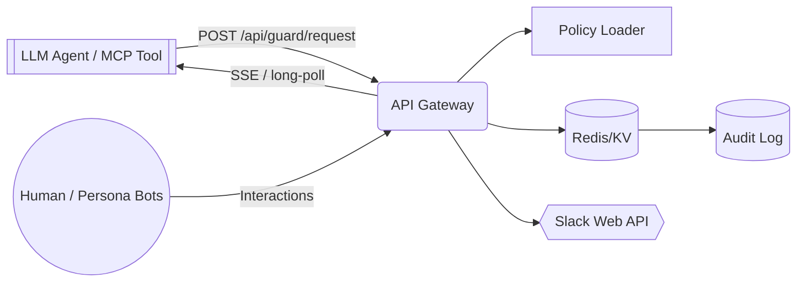
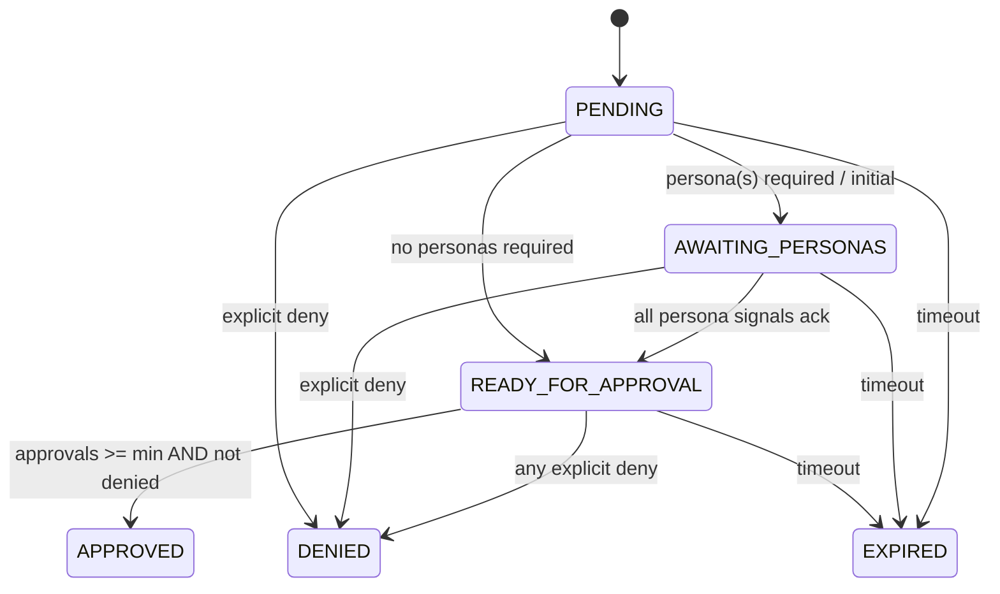
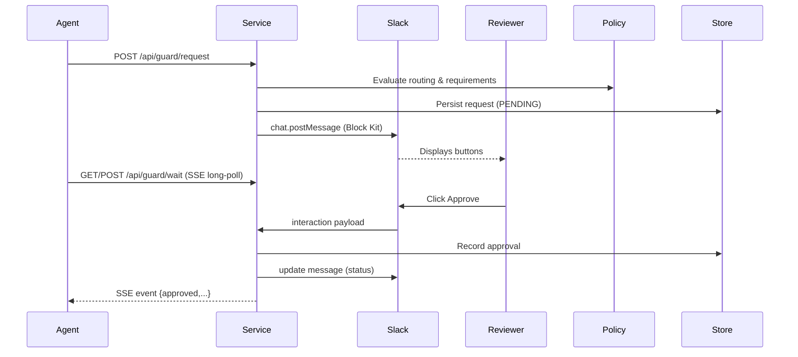

## Assumptions & Scope

1. Service is multi-tenant but initial iteration can run single-tenant (one org) with future org_id namespacing reserved in data model.
2. Redis is available (or Upstash / Cloudflare KV). Fallback to SQLite for local dev only.
3. Slack app uses granular bot scopes; no channel history read required beyond posting & interaction callbacks.
4. Agents integrate via MCP tool interface or simple REST client; language agnostic.
5. Actions are synchronous from agent perspective: agent blocks on `guard.wait` or uses polling / SSE.
6. Persona signals come via Slack (bot messages or interaction checkboxes) not via external APIs in v1.
7. Policies are loaded from a repo-mounted `.agent/policies/guards.yml`; watch + reload (poll interval) acceptable.
8. All times stored in UTC ISO8601; durations in seconds.
9. Security priority: all request payloads hashed (SHA-256) before persistence; sensitive params redacted at render boundary using allowlist of safe fields.

## Objectives

Provide a Slack-mediated human/role approval gate for risky LLM agent operations with auditable decision trail, persona co-sign, escalation, and safe minimal privileges.

## Non-Goals (v1)

* Deep diff rendering (we link to existing PR / diff URLs instead).
* Automatic secret rotation execution; only gating the request.
* Full conversational threads summarization; we rely on Slack thread context.
* Cross-workspace Slack federation.

## High-Level Architecture



### Components

| Component | Responsibility |
|-----------|----------------|
| `server.ts` | HTTP endpoints, request validation, SSE wait stream |
| `slack.ts` | Slack message composition, signature verification, interaction handling |
| `policy.ts` | Load + cache YAML, evaluate allowlists & quorum rules |
| `store.ts` | Persistence (pending requests, approvals, persona signals, audit) |
| `personas.ts` | Manage persona registration, required signal tracking |
| `log.ts` | Structured audit emit (JSON lines) + persist summary |
| `sdk/guardTool.ts` | MCP tool functions & retries |
| `types.ts` | Zod schemas for runtime validation & OpenAPI alignment |

### Data Model (Conceptual)

```mermaid
erDiagram
  REQUEST ||--o{ APPROVAL : has
  REQUEST ||--o{ PERSONA_SIGNAL : requires
  REQUEST {
    string id
    string action
    string payload_hash
    json   redacted_params
    json   full_params_encrypted (optional future)
    json   meta { repo, branch, pr, requester, justification }
    string status (pending|approved|denied|expired)
    int    min_approvals
    int    approvals_count
    string[] required_personas
    datetime created_at
    datetime expires_at
    datetime decided_at
    string decided_by_summary
    string slack_channel
    string slack_message_ts
  }
  APPROVAL {
    string id
    string request_id
    string actor_slack_id
    string actor_type (human|persona)
    string decision (approved|denied)
    json   param_overrides
    datetime created_at
  }
  PERSONA_SIGNAL {
    string id
    string request_id
    string persona
    string actor_slack_id
    string state (pending|ack|rejected)
    json   notes
    datetime created_at
    datetime updated_at
  }
  AUDIT_LOG {
    string id
    string request_id
    string event_type
    json   payload
    datetime created_at
  }
```

### Request Lifecycle States



### Sequence: Standard Approval



### Sequence: Persona Co-Sign

```mermaid
sequenceDiagram
    participant Agent
    participant Service
    participant QA as QA Bot
    participant Arch as Architect Bot
    participant Slack
    Agent->>Service: request (requires QA, Architect)
    Service->>Slack: Post with checklist
    QA->>Slack: Mark QA ✅ (button / checkbox)
    Slack->>Service: interaction (persona_signal)
    Arch->>Slack: Mark Architect Ack
    Slack->>Service: interaction
    Service->>Store: update signals; state -> READY_FOR_APPROVAL
    Human Reviewer->>Slack: Approve
    Slack->>Service: interaction
    Service->>Store: approvals_count=1 meets min
    Service-->>Agent: approved
```

### Escalation & Timeout

* Scheduler (interval worker) scans `status in (pending, awaiting_personas, ready_for_approval)` where `expires_at < now()`.
* Marks `EXPIRED`, emits audit, updates Slack message to show expired & optionally offers a `Re-request` button (generates a new token referencing original request_id for traceability).
* Before expiry threshold (e.g., 75% of timeout), sends one escalation ping to fallback channel/user.

## Security & Threat Model

| Threat | Vector | Mitigation |
|--------|--------|------------|
| Spoofed Slack interaction | Forged HTTP request | Verify Slack signature (v2) & timestamp skew < 5m |
| Replay of old interaction | Re-send payload | Store used interaction `payload_id` (hash) & reject duplicates |
| Unauthorized approval | User not in allowlist | Policy enforcement (allowlist + persona gating) before state change |
| Escalation spam | Malicious re-request | Rate-limit re-requests per request lineage & record lineage id |
| Payload tampering | Agent modifies after approval | Hash stored at creation; approve only returns stored redacted/overridden param set |
| Secret leakage in logs | Verbose logging | Redaction at serialization boundary; maintain `SAFE_PARAM_KEYS` allowlist |
| Token guessing | Predictable IDs | Use `crypto.randomUUID()` or 128-bit random; tokens scoped & TTL |
| Denial-of-service (lots of requests) | Flood agent requests | Global + per-action rate limiting; store counters in Redis bucket |
| Stale policy usage | Outdated allowlists | Version policy with hash; include policy_hash in request record for audit |
| Man-in-the-middle (Agent->Service) | Unencrypted channel | Enforce HTTPS / HSTS; optional mTLS for internal usage |
| Privilege escalation (broad Slack scopes) | Excess scopes | Minimal scopes only; no channel history read |

### Additional Controls
* All decisions idempotent: state transition guarded by compare-and-set on current status.
* Parameter overrides validated against zod schema per action (optional registry).
* Structured audit log egress to SIEM via stdout JSON lines.

## Slack Message Structure

Core blocks: Header, Context (repo/branch/PR), Summary fields, Actions (buttons), Persona checklist (if required), Footer (status / timestamps).

### Block Kit Examples

#### Approval Request (Initial)
```json
{
  "blocks": [
    {"type": "header", "text": {"type": "plain_text", "text": "Guard Request: npm_install"}},
    {"type": "context", "elements": [
      {"type": "mrkdwn", "text": "Repo: *acme/web* • Branch: *feature/dep-upgrade*"},
      {"type": "mrkdwn", "text": "Requester: <@U12345>"}
    ]},
    {"type": "section", "fields": [
      {"type": "mrkdwn", "text": "*Action*\n`npm_install`"},
      {"type": "mrkdwn", "text": "*Justification*\nUpgrade security patch"},
      {"type": "mrkdwn", "text": "*Packages*\n`lodash@^4.17.21`"},
      {"type": "mrkdwn", "text": "*Timeout*\n10m"}
    ]},
    {"type": "section", "text": {"type": "mrkdwn", "text": "Payload Hash: `ab12cdef...`"}},
    {"type": "divider"},
    {"type": "actions", "block_id": "approval_actions", "elements": [
      {"type": "button", "action_id": "approve", "text": {"type": "plain_text", "text": "Approve"}, "style": "primary", "value": "REQ_ID"},
      {"type": "button", "action_id": "deny", "text": {"type": "plain_text", "text": "Deny"}, "style": "danger", "value": "REQ_ID"},
      {"type": "button", "action_id": "more_info", "text": {"type": "plain_text", "text": "More info"}, "value": "REQ_ID"}
    ]},
    {"type": "context", "elements": [
      {"type": "mrkdwn", "text": "Policy: min 1 approval • Personas: QA"}
    ]}
  ]
}
```

#### Persona Checklist Block (Inserted / Updated)
```json
{
  "type": "section",
  "block_id": "persona_checklist",
  "text": {"type": "mrkdwn", "text": "*Persona Co-Sign Required*"},
  "accessory": {
    "type": "checkboxes",
    "action_id": "persona_ack",
    "options": [
      {"text": {"type": "mrkdwn", "text": "QA ✅"}, "description": {"type": "mrkdwn", "text": "Quality validation"}, "value": "QA"},
      {"text": {"type": "mrkdwn", "text": "Architect Ack"}, "description": {"type": "mrkdwn", "text": "Architecture review"}, "value": "Architect"}
    ],
    "initial_options": []
  }
}
```

Update pattern: on each persona signal we re-render with `initial_options` including completed personas; when all satisfied, enable Approve button (or show note in context block).

#### Timeout / Escalation Notice
```json
{
  "blocks": [
    {"type": "section", "text": {"type": "mrkdwn", "text": ":hourglass_flowing_sand: *Request Expired* (REQ_ID)"}},
    {"type": "context", "elements": [
      {"type": "mrkdwn", "text": "No decision within policy timeout (10m)."}
    ]},
    {"type": "actions", "elements": [
      {"type": "button", "action_id": "re_request", "text": {"type": "plain_text", "text": "Re-request"}, "value": "REQ_ID"}
    ]}
  ]
}
```

#### Denied Update Example
```json
{
  "blocks": [
    {"type": "header", "text": {"type": "plain_text", "text": "Request Denied"}},
    {"type": "section", "text": {"type": "mrkdwn", "text": "<@U67890> denied request *REQ_ID* for `npm_install`. Reason: *Potential license issue*"}},
    {"type": "context", "elements": [{"type": "mrkdwn", "text": "This request is now closed."}]}
  ]
}
```

## Policy Evaluation Algorithm (Simplified)

1. Load & parse YAML → internal model.
2. On request: locate action config; if missing → default policy (deny or manual approve fallback) depending on config flag.
3. Determine required personas & min approvals, build allowlist set.
4. Initialize request state: `AWAITING_PERSONAS` if personas required else `READY_FOR_APPROVAL`.
5. When interaction arrives:
   * If persona signal: update persona state; if all `ack`, transition to `READY_FOR_APPROVAL` and update message enabling Approve.
   * If approval: verify actor in allowlist & state == READY_FOR_APPROVAL; increment approvals; if approvals >= min → APPROVED.
   * If deny: immediate DENIED (unless already terminal).
6. Expiry: transition to EXPIRED unless terminal.

## Observability
* Metrics: counts (requests, approvals, denies, expired), latency (request→decision), queue time until first interaction.
* Tracing: optional OpenTelemetry instrumentation in HTTP handlers & Slack API calls.

## Deployment Model
* Container or serverless function (e.g., Cloudflare Workers) with fetch router. Provide adapter layer for Node (Express-style) & Workers (Durable Objects for store optional).
* Config via environment variables + mounted policy file path.

## Open Questions (Flagged for Future)
* Support editing parameters before approve (UI ephemeral modal). For v1 stub accept but not implement full modals.
* Additional persona automation triggers (webhook ingestion) — out-of-scope v1.
* Pagination / retrieval of historical approvals — simple `/api/guard/request/:id` could be added.

## Conclusion

Design provides a secure, auditable gating mechanism with Slack interactive flows, minimal scopes, persona co-sign, and clear extension seams.
